========
 rule30
========

|Supported Python versions| |Docs| |License|

This project efficiently implements Stephen Wolfram's elementary cellular automata (Rule 30 being a notable example), specifically their single 1 histories. Histories can be generated in various matrix formats (including ``numpy.ndarray``) and exported as strings or images.

.. |Supported Python versions| image:: https://img.shields.io/badge/python-3.3,3.4,3.5,3.6-blue.svg?maxAge=2592000
.. |Docs| image:: https://img.shields.io/badge/docs-latest-green.svg?maxAge=2592000
   :target: https://rule30.zhimingwang.org
.. |License| image:: https://img.shields.io/badge/license-MIT-blue.svg?maxAge=2592000
   :target: COPYING

.. contents::
   :backlinks: top

API reference
-------------

See `rule30.zhimingwang.org <https://rule30.zhimingwang.org>`_.

Console script
--------------

::

   $ rule30 --help
   usage: rule30 [-h] [-n ROWS] [-r [RULE]] [-s BLOCK_SIZE] [--version] [--debug]
                 image

   Generate images for the single 1 histories of Stephen Wolfram's elementary
   cellular automata.

   positional arguments:
     image                 path to the output image (PNG format)

   optional arguments:
     -h, --help            show this help message and exit
     -n ROWS, --rows ROWS  number of rows to generate; default is 256
     -r [RULE], --rule [RULE]
                           Wolfram code of the rule (between 0 and 255); default
                           is 30
     -s BLOCK_SIZE, --block-size BLOCK_SIZE
                           the size in pixels for each cell; default is 1
     --version             show program's version number and exit
     --debug               enable debug messages

See also
--------

- `Elementary Cellular Automaton <https://en.wikipedia.org/wiki/Elementary_cellular_automaton>`__, Wikipedia;
- `Rule 30 <https://en.wikipedia.org/wiki/Rule_30>`__, Wikipedia;
- `Elementary Cellular Automaton <http://mathworld.wolfram.com/ElementaryCellularAutomaton.html>`__, Wolfram MathWorld;
- `Cellular Automata <https://plato.stanford.edu/entries/cellular-automata/index.html>`__, Stanford Encyclopedia of Philosophy;
- `The 256 Rules <https://plato.stanford.edu/entries/cellular-automata/supplement.html>`__, Stanford Encyclopedia of Philosophy.

Images
------

Here are the images for some interesting rules with individual pages on `Wolfram MathWorld <http://mathworld.wolfram.com/ElementaryCellularAutomaton.html>`_. Images for all 256 rules can be found in the ``images`` directory.

`Rule 30 <http://mathworld.wolfram.com/Rule30.html>`_:

.. image:: images/rule30.png

`Rule 50 <http://mathworld.wolfram.com/Rule50.html>`_:

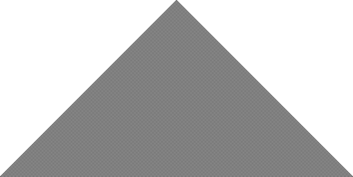

`Rule 54 <http://mathworld.wolfram.com/Rule54.html>`_:

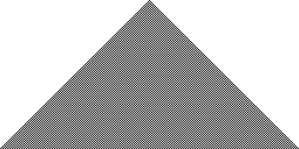

`Rule 60 <http://mathworld.wolfram.com/Rule60.html>`_:

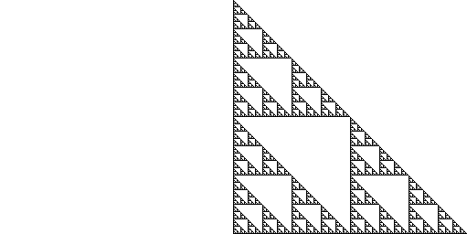

`Rule 62 <http://mathworld.wolfram.com/Rule62.html>`_:

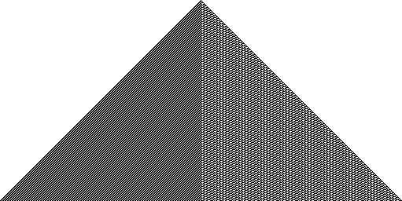

`Rule 90 <http://mathworld.wolfram.com/Rule90.html>`_:

`Rule 94 <http://mathworld.wolfram.com/Rule94.html>`_:

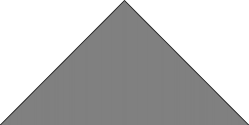

`Rule 102 <http://mathworld.wolfram.com/Rule102.html>`_:

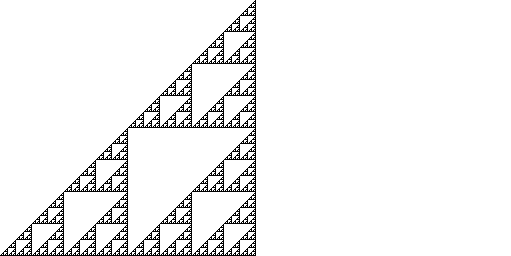

`Rule 110 <http://mathworld.wolfram.com/Rule110.html>`_:

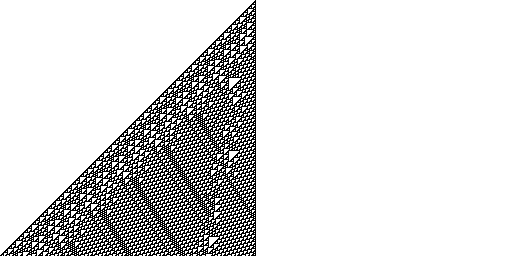

`Rule 126 <http://mathworld.wolfram.com/Rule126.html>`_:

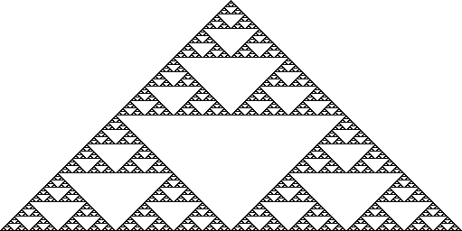

`Rule 150 <http://mathworld.wolfram.com/Rule150.html>`_:

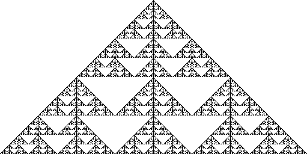

`Rule 158 <http://mathworld.wolfram.com/Rule158.html>`_:

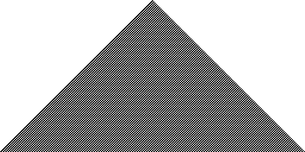

`Rule 182 <http://mathworld.wolfram.com/Rule182.html>`_:

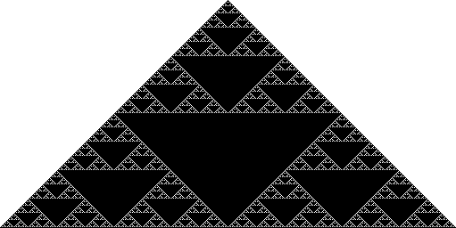

`Rule 188 <http://mathworld.wolfram.com/Rule188.html>`_:

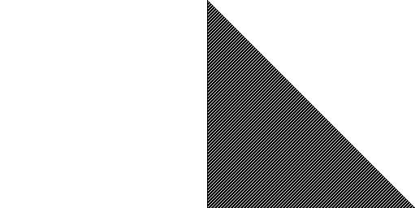

`Rule 190 <http://mathworld.wolfram.com/Rule190.html>`_:

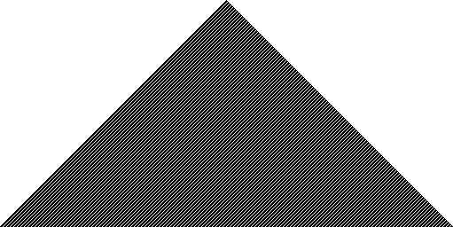

`Rule 220 <http://mathworld.wolfram.com/Rule220.html>`_:

`Rule 222 <http://mathworld.wolfram.com/Rule222.html>`_:

License
-------

Copyright (c) 2017 Zhiming Wang <zmwangx@gmail.com>

This project is licensed under the MIT license. See ``COPYING`` for details.
